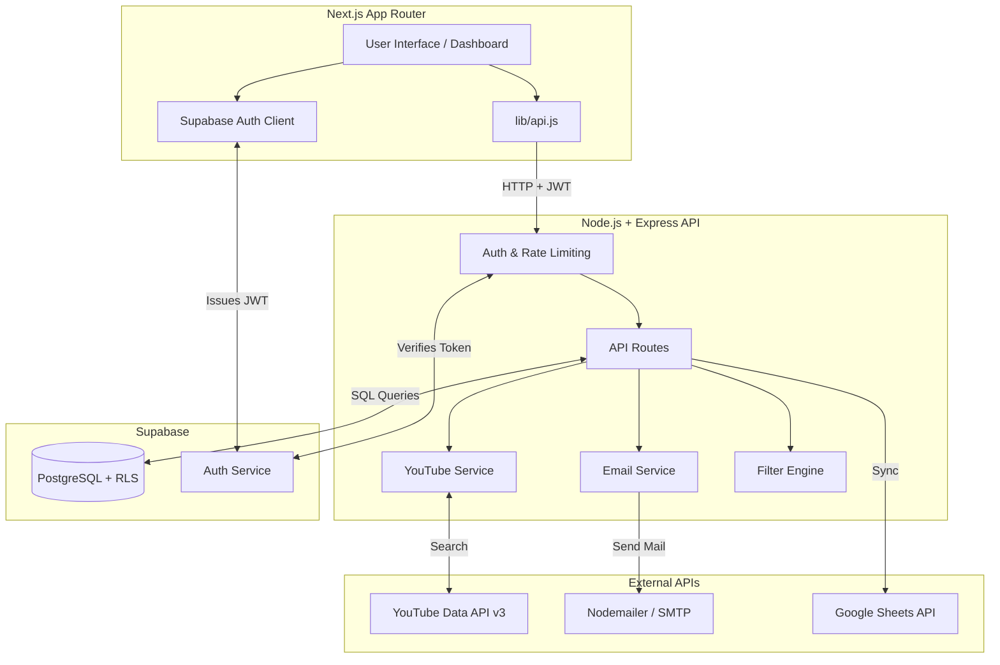

# 🎬 CreatorFind
**YouTube Creator Discovery & Automated Outreach SaaS**

Welcome to **CreatorFind**, your ultimate powerhouse for discovering YouTube creators, analyzing their performance, extracting contact details, and launching highly personalized email campaigns. Whether you're an agency, a sponsor, or a brand, this platform automates the tedious manual work of creator outreach into a streamlined, high-performance workflow.

---

## 🌟 What is CreatorFind?

CreatorFind is a production-grade, full-stack web application designed to connect you with the right YouTube creators instantly. You input your niche keywords and criteria (like minimum subscribers or views), and CreatorFind scours YouTube, filters the noise, extracts public business emails, and even sends personalized pitches using your own email servers. It's built for scale, speed, and security.

---

## ✨ Core Features (Everything it can do!)

* 🔍 **Smart YouTube Discovery Engine**
  * Search the entire YouTube platform globally using specific keywords.
  * Apply strict filters: Set minimum/maximum subscribers and minimum average views.
  * **Auto-Scraping**: Automatically extracts valid business emails from channel descriptions using smart regex patterns.
* 📧 **Automated Email Campaigns**
  * Draft reusable email templates utilizing dynamic variables (e.g., `Hi {channelName}, love your recent videos!`).
  * Connect your custom SMTP credentials (like Gmail, Outlook, or Amazon SES) securely.
  * Send bulk emails sequentially to avoid spam filters and track delivery statuses.
* 📊 **Interactive Real-Time Dashboard**
  * Beautiful, animated charts built with Recharts to visualize your outreach success.
  * Track Key Performance Indicators (KPIs): Total channels found, active campaigns, and emails dispatched.
  * "Recent Activity" feed to keep track of your team's workflow.
* 📑 **Google Sheets Synchronization**
  * Automatically push your curated list of discovered channels directly to a Google Sheet.
  * Perfect for collaborating with team members who don't use the platform.
* 🔐 **Enterprise-Grade Security & Multi-Tenancy**
  * Powered by **Supabase Auth** (JWT) for secure login.
  * **PostgreSQL Row Level Security (RLS)** ensures that your data (channels, campaigns, emails) is strictly isolated from other users.
  * Backend API protected by Helmet, CORS, Express Rate Limiting, and robust input validation.
* 🎨 **Premium Aesthetic**
  * Gorgeous "Dark Mode" UI featuring deep navy tones, glassmorphism effects, dynamic 3D interactions on the landing page, and modern typography.

---

## 🛠️ What We Used (The Technology Stack)

CreatorFind is built on a modern, decoupled architecture ensuring lightning-fast performance and high maintainability.

### Frontend (Client-Side)
* **Framework:** Next.js 15 (App Router) - For fast server-side rendering and routing.
* **Library:** React 19 - For building interactive user interfaces.
* **Styling:** Vanilla CSS Modules - Ensuring scoped, conflict-free styling with a premium aesthetic (no bloated frameworks).
* **Icons & Charts:** Lucide-React for crisp SVG icons, Recharts for dynamic data visualization.
* **State & Auth:** React Hooks, `@supabase/ssr` (Supabase Server-Side Rendering Client).

### Backend (Server-Side)
* **Runtime:** Node.js (v20+)
* **Framework:** Express.js 4 - Handling RESTful API requests.
* **Security & Reliability:** `helmet` (HTTP headers), `cors`, `express-rate-limit` (DDoS protection), `express-validator` (input sanitization), `p-limit` (concurrency control).
* **Integrations:** `googleapis` (Official Google library for YouTube v3 & Sheets API), `nodemailer` (SMTP Email dispatch).
* **Logging:** Winston Logger (`@google-cloud/logging-winston`) for professional server logs.

### Database & Authentication
* **Platform:** Supabase (Open-source Firebase alternative).
* **Database:** PostgreSQL with strict Row Level Security (RLS) policies.
* **Auth:** Supabase JWT Authentication.

---

## 🏗️ System Architecture & How It Works

Here is the exact journey of data through the CreatorFind platform:

### 1. Authentication Flow
* The user visits the stunning 3D Next.js Landing Page and logs in via the `LoginClient.js`.
* **Supabase Auth** verifies the credentials and returns a secure JSON Web Token (JWT).
* This JWT is saved in cookies/local storage. Every time the frontend makes an API request to the Node.js backend using `lib/api.js`, it attaches this JWT in the `Authorization: Bearer <token>` header.
* The Express backend uses `middleware/supabaseAuth.js` to cryptographically verify this token before allowing access to any route.

### 2. The Discovery Pipeline
* A user goes to the "Discover" page and fills out the `FilterForm.js` (Keywords, Min Subs, Min Views).
* The request hits the `routes/channels.js` on the backend.
* **Data Fetching:** The backend uses `services/youtubeService.js` to call the YouTube Data API v3, pulling raw channel and video data.
* **Filtering & Scraping:** The `services/filterEngine.js` kicks in. It analyzes recent videos to calculate true average views, throws out channels that don't meet the criteria, and runs regex against descriptions to find emails.
* **Storage:** Valid channels are injected into the PostgreSQL database under the user's specific ID.

### 3. Campaign Drafting & Execution
* The user connects their email account via the "Settings" page (saved securely via `routes/settings.js`).
* They draft a message in the "Campaigns" page.
* When they click "Send", `routes/emails.js` receives the command.
* **Dispatch:** The backend pulls the selected channels and the user's SMTP credentials. `services/emailService.js` loops through the channels, replaces `{channelName}` with the actual name, and sends the email via Nodemailer.
* Results are logged in the `email_logs` database table.



---

## 🗂️ Detailed File Architecture (Which File Does What)

Understanding the codebase is easy once you know where to look. Here is the complete map:

### 🌐 Frontend (`frontend/src/`)
**`app/` (The Pages & Routing)**
*   **`LandingPage.js`**: The highly interactive, 3D animated welcome page for unauthenticated users.
*   **`LoginClient.js`**: Handles the UI and logic for user sign-in/sign-up via Supabase.
*   **`dashboard/page.js`**: The main dashboard home. Fetches and displays top-level statistics and the recent activity feed.
*   **`dashboard/DashboardLayoutClient.js`**: The wrapper for the dashboard that keeps the Sidebar and Header visible across all sub-pages.
*   **`dashboard/discover/page.js`**: The page where users input search terms to find new YouTube channels.
*   **`dashboard/channels/page.js`**: The CRM-style table viewing all saved channels.
*   **`dashboard/campaigns/page.js`**: Where users draft and save their email templates.
*   **`dashboard/emails/page.js`**: The interface for actually launching email blasts to selected channels.
*   **`dashboard/settings/page.js`**: Where users securely input their custom SMTP server credentials.

**`components/` (Reusable UI Elements)**
*   **`Sidebar.js` & `Header.js`**: The main navigation menus for the dashboard.
*   **`StatsCard.js`**: The small, stylized KPI boxes (e.g., "Total Emails Sent").
*   **`Chart.js`**: The Recharts implementation for visual data graphs on the dashboard.
*   **`ChannelTable.js`**: The complex data grid used to display discovered creators, allowing sorting and selection.
*   **`FilterForm.js`**: The input form used on the Discover page to set parameters (keywords, min views, etc.).

**`lib/` & `utils/` (Core Logic)**
*   **`lib/api.js`**: **CRITICAL FILE.** A universal wrapper for JavaScript's `fetch()`. It automatically attaches the Supabase JWT to every request sent to the Node.js backend, handles timeouts, and standardizes error responses.
*   **`utils/supabase/`**: Contains the initialization logic for the Supabase SSR client to talk to the database from the Next.js frontend.

### ⚙️ Backend (`backend/src/`)
**`app.js` (The Engine)**
*   The main entry point for the Express server. It initializes CORS, Helmet, routes, and error handlers.
*   **`demo-server.js`**: A secondary server file likely used for local testing or mock-data demonstrations.

**`routes/` (API Endpoints)**
*   **`auth.js`**: Handles backend authentication tasks or profile syncing.
*   **`channels.js`**: Endpoints for triggering YouTube searches and retrieving saved channels from the DB.
*   **`campaigns.js` & `emails.js`**: Endpoints for saving templates and triggering the email dispatch sequence.
*   **`settings.js`**: Secures and retrieves the user's SMTP configurations.
*   **`sheets.js`**: Endpoint to trigger the syncing of channels to Google Sheets.
*   **`analytics.js`**: Aggregates data (counts, averages) from the DB to serve to the frontend `Chart.js` and `StatsCard.js`.

**`services/` (The Heavy Lifting / Business Logic)**
*   **`youtubeService.js`**: Interfaces directly with the official Google APIs. Handles pagination, quota management, and fetching raw YouTube data.
*   **`filterEngine.js`**: The brain of the discovery. It takes raw YouTube data, parses recent videos to calculate accurate average views, checks subscriber counts against user limits, and uses Regex to scrape the channel description for emails.
*   **`emailService.js`**: Takes user SMTP credentials, connects via Nodemailer, parses dynamic template variables (like replacing `{channelName}`), and dispatches the emails safely.
*   **`sheetsService.js`**: Authenticates via a Google Service Account and writes channel data directly into a connected Google Sheet.
*   **`hybridFetchService.js`**: A specialized internal service, likely used for complex API calls requiring retries or fallback mechanisms.

**`middleware/` (The Bouncers)**
*   **`supabaseAuth.js`**: Intercepts incoming requests, reads the JWT Bearer token, and asks Supabase if the token is valid. If not, it rejects the request (401 Unauthorized).
*   **`rateLimiter.js`**: Prevents abuse by limiting how many times an IP can hit the API within a timeframe.
*   **`validator.js`**: Checks incoming request bodies (like ensuring an email is actually formatted like an email) before the route processes it.
*   **`errorHandler.js`**: Catches crashes and formats them into clean JSON responses for the frontend, logging the actual error via Winston.

---

## 🗄️ Database Schema Overview (PostgreSQL)

Because we use Supabase, our Postgres database is heavily protected by **Row Level Security (RLS)**. Every table has a `user_id` column, and policies dictate that a user can *only* select, insert, update, or delete rows where `user_id === auth.uid()`.

* **`users`**: Extended profile data.
* **`channels`**: The scraped YouTube channels.
* **`campaigns`**: Saved email templates (subject, body).
* **`email_logs`**: A ledger of every single email sent, its success status, and error messages if any failed.
* **`search_history`**: Audit logs of what keywords users searched for and how many results were found.
* **`email_settings`**: Securely stores the user's custom SMTP host, port, user, and password.

---

## 🚀 How to Run Locally

Want to spin this up on your own machine? Follow these steps:

### 1. Prerequisites
* Node.js (v18 or higher)
* A [Supabase](https://supabase.com/) Project (Free tier works perfectly)
* A Google Cloud Console Project (with **YouTube Data API v3** enabled)

### 2. Database Setup
1. Open your Supabase project dashboard.
2. Navigate to the SQL Editor.
3. Copy and run the SQL schema files located in the `supabase/migrations/` directory of this repo. This will instantly build your tables and RLS security policies.

### 3. Backend Setup
Open a terminal and run:
```bash
cd backend
npm install
```
Create a `.env` file in the `backend/` directory:
```env
PORT=8080
FRONTEND_URL=http://localhost:3000
YOUTUBE_API_KEY=your_google_youtube_api_key
SUPABASE_URL=your_supabase_project_url
SUPABASE_SERVICE_ROLE_KEY=your_supabase_service_role_key

# Optional: For Google Sheets Integration
GOOGLE_SHEETS_CREDENTIALS={"type":"service_account",...}
```
Start the backend server:
```bash
npm run dev
```

### 4. Frontend Setup
Open a second terminal window and run:
```bash
cd frontend
npm install
```
Create a `.env.local` file in the `frontend/` directory:
```env
NEXT_PUBLIC_API_URL=http://localhost:8080
NEXT_PUBLIC_SUPABASE_URL=your_supabase_project_url
NEXT_PUBLIC_SUPABASE_ANON_KEY=your_supabase_anon_key
```
Start the Next.js development server:
```bash
npm run dev
```

**🎉 Boom! You're done.** Open your browser and go to `http://localhost:3000` to see CreatorFind in action.

---

## 📄 License
Private — All rights reserved. Built for creators, by creators.
