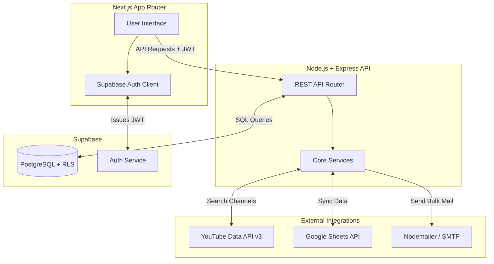

<div align="center">
  
# 🎬 CreatorFind
**YouTube Creator Discovery & Automated Outreach SaaS**

CreatorFind is a production-grade, full-stack platform designed to automate the process of finding YouTube creators, filtering them by engagement metrics, extracting their contact information, and launching personalized email campaigns.

</div>

---

## 🌟 Overview

Finding the right YouTube creators for sponsorships or collaborations is historically a manual, time-consuming process. **CreatorFind** solves this by providing a unified dashboard where users can query the YouTube API, instantly filter out channels that don't meet their subscriber or view criteria, extract public business emails via regex, and dispatch personalized emails securely via their own SMTP servers.

---

## ✨ Core Features

* 🔍 **Smart Discovery Engine**
  * Search YouTube globally using keywords and advanced filters.
  * Define thresholds for minimum/maximum subscribers and minimum average views.
  * Automatically scrapes public channel descriptions to extract valid business emails.
* 📧 **Automated Email Campaigns**
  * Create reusable email templates with dynamic variables (e.g., `Hi {channelName}`).
  * Connect custom SMTP credentials securely to send bulk emails.
  * Track email delivery statuses directly within the platform.
* 📊 **Real-Time Analytics Dashboard**
  * Visualize outreach performance with interactive Recharts.
  * Monitor total channels discovered, active campaigns, and total emails sent.
  * View recent activity feeds of discovery runs and outreach attempts.
* 📑 **Google Sheets Synchronization**
  * Effortlessly sync your curated list of channels to a connected Google Sheet.
  * Handled via a Google Cloud Service Account for seamless background updates.
* 🔐 **Enterprise-Grade Security**
  * Powered by Supabase Auth (JWT) and PostgreSQL Row Level Security (RLS) to ensure complete data isolation between users.
  * Backend secured with Helmet, CORS, and Express Rate Limiting.

---

## 🏗️ System Architecture

CreatorFind utilizes a decoupled, modern web architecture:



---

## 💻 Technology Stack

### Frontend
* **Framework:** Next.js 15 (App Router)
* **Library:** React 19
* **Styling:** CSS Modules with a premium "Dark Mode" glassmorphism aesthetic
* **Icons & Charts:** Lucide-React, Recharts
* **State & Auth:** React Hooks, Supabase SSR Client

### Backend
* **Runtime:** Node.js (v20+)
* **Framework:** Express.js
* **Security:** Helmet, CORS, Express-Rate-Limit, Express-Validator
* **Integrations:** `googleapis` (YouTube & Sheets), `nodemailer` (SMTP Emails)
* **Logging:** Winston Logger

### Database & Auth
* **Platform:** Supabase
* **Database:** PostgreSQL
* **Security:** Row Level Security (RLS) policies enforcing multi-tenant data isolation

---

## ⚙️ How It Works (Module Breakdown)

### 1. Authentication & Security
* Users sign up/log in through the frontend via Supabase.
* The frontend passes the returned JWT Bearer token in the `Authorization` header of all API calls.
* The backend verifies the token using Supabase's Admin SDK to ensure the user is valid before processing the request.

### 2. The Discovery Pipeline
* A user submits a search keyword and filters via the UI.
* The backend (`youtubeService.js`) hits the YouTube Data API to fetch matching channels in batches.
* The `filterEngine.js` parses the results, checking subscriber limits and calculating average views from recent videos.
* A Regex engine scans the channel description to isolate valid email addresses.
* Valid channels are saved to the Supabase `channels` table under the user's ID.

### 3. Campaign Drafting & Execution
* Users input their custom SMTP configuration in the Settings page (saved securely).
* Users create an outreach Campaign, defining the Subject and Body with `{channelName}` placeholders.
* Upon execution, the backend pulls the selected channels, injects the dynamic variables using `emailService.js`, and dispatches the emails sequentially to avoid rate-limiting.
* Logs are written to `email_logs` to track success/failures.

---

## 🗄️ Database Schema Overview

The Supabase PostgreSQL database is structured with strict Row Level Security (RLS):

* **`users`**: Extended profile data synchronized with Supabase Auth.
* **`channels`**: Discovered YouTube channels. Linked to the user who found them.
* **`campaigns`**: Saved email templates and campaign metadata.
* **`email_logs`**: Detailed logs of every email sent, linking to campaigns and channels.
* **`search_history`**: Audit logs of user discovery searches and performance metrics.
* **`email_settings`**: Securely stored SMTP credentials for individual users.
* **`api_usage` & `system_settings`**: Admin tables for monitoring global API health.

---

## 📁 Project Structure

```text
creatorfind/
├── backend/                  # Node.js + Express API
│   ├── src/
│   │   ├── config/           # Logger, API keys, Supabase DB initialization
│   │   ├── middleware/       # JWT Auth verification, Rate Limiting, Error Handlers
│   │   ├── routes/           # REST endpoints (auth, channels, campaigns, emails)
│   │   └── services/         # Core Logic (YouTube, Email, Sheets, Filters)
│   ├── app.js                # Express app entry point
│   └── package.json
│
├── frontend/                 # Next.js Application
│   ├── src/
│   │   ├── app/              # App Router pages (Dashboard, Admin, Auth)
│   │   ├── components/       # Reusable UI widgets (Charts, Stat Cards, Sidebar)
│   │   ├── lib/              # API fetch wrappers
│   │   └── utils/            # Supabase client utilities
│   └── next.config.js
│
└── supabase/
    └── migrations/           # SQL files defining schema, triggers, and RLS policies
```

---

## 🛠️ Local Development Guide

### 1. Prerequisites
* Node.js (v18+)
* A Supabase Project
* A Google Cloud Console Project (with YouTube Data API v3 and Google Sheets API enabled)

### 2. Database Setup
Execute the SQL files located in `supabase/migrations/` in your Supabase SQL editor. This establishes all tables, relationships, and RLS policies.

### 3. Backend Setup
```bash
cd backend
npm install
```
Create a `.env` file in `backend/`:
```env
PORT=8080
FRONTEND_URL=http://localhost:3000
YOUTUBE_API_KEY=your_google_api_key
SUPABASE_URL=your_supabase_project_url
SUPABASE_SERVICE_ROLE_KEY=your_supabase_service_role_key

# Optional: For Google Sheets Integration
GOOGLE_SHEETS_CREDENTIALS={"type":"service_account",...}
```
Run the backend:
```bash
npm run dev
```

### 4. Frontend Setup
```bash
cd frontend
npm install
```
Create a `.env.local` file in `frontend/`:
```env
NEXT_PUBLIC_API_URL=http://localhost:8080
NEXT_PUBLIC_SUPABASE_URL=your_supabase_project_url
NEXT_PUBLIC_SUPABASE_ANON_KEY=your_supabase_anon_key
```
Run the frontend:
```bash
npm run dev
```

The application will be running at `http://localhost:3000`.

---

## 📄 License
Private — All rights reserved.
